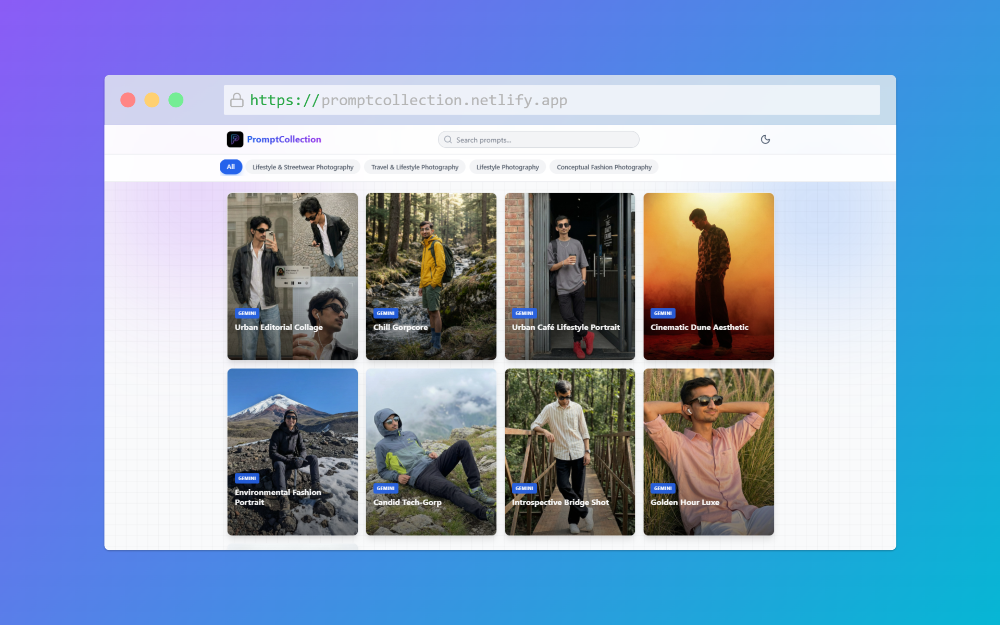

# 🎨 PromptCollection

[](LICENSE)


A curated collection of powerful AI image generation prompts for Gemini and ChatGPT. Discover, share, and copy prompts with ease.

## 🌐 Live Demo

<div align="center">
  <a href="https://promptcollection.netlify.app/">
    
  </a>
  <br>
  <a href="https://promptcollection.netlify.app/">
    
  </a>
</div>

## 📂 File Structure

```bash
PromptCollection/
├── Images/                          # Your 3 example images
│   ├── Surreal_paper_portrait.png
│   ├── Classic_portrait_photography.png  
│   └── Power_suit_portrait.png
├── .github/                        # Issue templates
│   └── ISSUE_TEMPLATE/            
│       ├── bug-report.md
│       ├── feature-request.md
│       └── prompt-submission.md   
├── index.html                      # Main app (128 lines)
├── styles.css                      # Styling (500+ lines)
├── script.js                       # Logic (250+ lines)
├── data.json                       # Your 3 prompts
├── README.md                       # Documentation
├── CONTRIBUTING.md                 # Contribution guidelines
├── SECURITY.md                     # Security policy
└── LICENSE                         # MIT License
```

## 🤝 Contributing

We welcome contributions! Please see our:
- [Contribution Guidelines](CONTRIBUTING.md) - How to add prompts and report issues
- [Open an Issue](https://github.com/Sagarbudhwani/prompt-collection/issues) - Choose from our templates

## 🐛 Issues & Support

Found a bug or need help?
- [Open Issues](https://github.com/Sagarbudhwani/prompt-collection/issues) and select a template:
  - 🐛 Bug Report
  - 💡 Feature Request  
  - 🎨 Prompt Submission

## 🚀 Features

**Prompt Management:**
- 🔍 Smart search functionality
- 🏷️ Filter by AI model (Gemini, ChatGPT)
- 📋 One-click prompt copying
- 🔗 Easy sharing options

**User Experience:**
- 🌙 Dark/Light mode toggle
- 📱 Fully responsive design
- 🎨 Beautiful card-based UI
- ⚡ Fast and lightweight

**Content Organization:**
- 🗂️ Categorized by AI model
- 🔖 Tagged for easy discovery
- ⭐ Featured prompts highlighting
- 📊 Sort by newest, popular, or A-Z

## 📚 Documentation

- [Wiki](https://github.com/Sagarbudhwani/prompt-collection/wiki) - Detailed guides and FAQs
- [Live Demo](https://promptcollection.netlify.app/) - Try it out
- [Customization Guide](https://github.com/Sagarbudhwani/prompt-collection/wiki/Customization) - Modify colors and layout

## 🎮 Quick Start

1. **Clone or download the repository**

```bash
git clone https://github.com/Sagarbudhwani/PromptCollection.git
```

2. **Open in browser**
   - Simply open `index.html` in any modern browser
   - No build process or dependencies required

3. **Start exploring!**
   - Browse prompts by scrolling
   - Use search to find specific prompts
   - Filter by AI model using the buttons
   - Click "Copy" to use any prompt

## 🛠️ For Developers

**Adding New Prompts:**
Edit `data.json` or [submit a prompt via issues](https://github.com/Sagarbudhwani/prompt-collection/issues).

**Customization Options:**
- Modify colors in the `:root` CSS variables
- Add new filter categories in HTML and JS
- See our [Customization Guide](https://github.com/Sagarbudhwani/prompt-collection/wiki/Customization) for details

**Technical Highlights:**
- Pure vanilla JavaScript (no frameworks)
- CSS variables for easy theming
- LocalStorage for theme preference persistence
- Responsive design with CSS Grid and Flexbox
- [Detailed technical docs in our Wiki](https://github.com/Sagarbudhwani/prompt-collection/wiki/Technical-Details)

## 🔒 Security

This is a static site with no backend. For security concerns, please see our [Security Policy](SECURITY.md).

## 📜 License

MIT © Sagar Budhwani - Free to use, modify, and share! See [LICENSE](LICENSE) for details.

## 👨‍💻 Developer

Developed by [Sagar Budhwani](https://github.com/Sagarbudhwani)

Check out more of my projects at [https://appsbysagar.netlify.app](https://appsbysagar.netlify.app)
